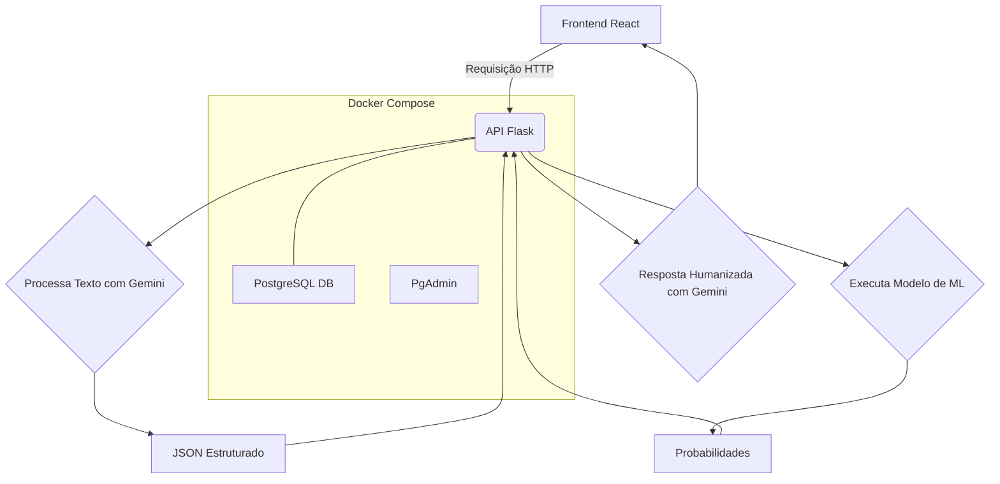
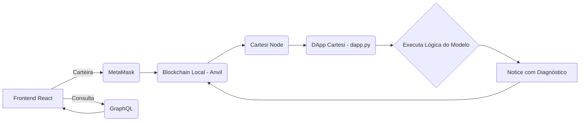

# 🧬 EpiScope - Analisador de Doenças com IA e Blockchain

O **EpiScope** é uma solução completa que une **Ciência de Dados**, **Inteligência Artificial** e **Blockchain** para criar um sistema de apoio ao diagnóstico de arboviroses (**Dengue, Zika e Chikungunya**) e doenças oculares (**Glaucoma**).  

A aplicação oferece duas modalidades de análise:  
- **API Web2 rápida e inteligente**, com suporte à **IA Generativa (Google Gemini)**.  
- **DApp Web3** com diagnóstico **verificável e descentralizado via Cartesi Machine**.  

---

## 📜 Índice
- ✨ [Funcionalidades Principais](#-funcionalidades-principais)
- 🏗️ [Arquitetura do Sistema](#-arquitetura-do-sistema)
- 🛠️ [Tecnologias Utilizadas](#-tecnologias-utilizadas)
- 🚀 [Começando](#-começando)
  - Pré-requisitos
  - Instalação e Configuração
- 🧠 [Geração e Aprendizado de Modelos](#-geração-e-aprendizado-de-modelos)
- 🏃 [Execução da Aplicação Completa](#-execução-da-aplicação-completa)
- 🌐 [Rotas e Payloads](#-rotas-e-payloads)
- 📁 [Estrutura do Projeto](#-estrutura-do-projeto)
- 🔮 [Próximos Passos](#-próximos-passos)
- ⚖️ [Licença](#-licença)

---

## ✨ Funcionalidades Principais

- **Arquitetura Híbrida Web2 & Web3:** API REST + DApp descentralizado.  
- **Pipeline de Dados Completo:** ingestão, limpeza, treinamento e diagnóstico.  
- **IA Generativa (Gemini):** interpreta sintomas em linguagem natural.  
- **Diagnóstico com ML:** modelos para arboviroses e CNN para glaucoma.  
- **Diagnóstico Verificável:** validação via **Cartesi Machine + MetaMask**.  
- **Ambiente Dockerizado:** execução rápida e isolada com **Docker Compose**.  
- **Banco de Dados Robusto:** **PostgreSQL + PgAdmin** com milhões de registros.  

---

## 🏗️ Arquitetura do Sistema

### Fluxo 1: Análise Rápida (Web2)



### Fluxo 2: Análise Verificável (Web3)



---

## 🛠️ Tecnologias Utilizadas

### **Backend (Web2)**
- Python (Flask)
- Google Gemini API  
- Scikit-learn  
- TensorFlow / Keras (CNN Glaucoma)  
- PostgreSQL + PgAdmin  
- Docker & Docker Compose  

### **Blockchain (Web3)**
- Cartesi Machine  
- MetaMask  
- GraphQL (Cartesi Node)  

### **Frontend**
- React + TypeScript + Vite  
- ethers.js  
- TailwindCSS  

---

## 🚀 Começando

### Pré-requisitos
- Node.js e npm  ou yarn
- Docker e Docker Compose  
- Cartesi CLI  
- Extensão MetaMask  

### Instalação e Configuração

```bash
# Clone o projeto principal (Web2 + Frontend)
git clone https://github.com/bisnet0/EpiScope---Disease-Data-Analyzer.git

# Clone o projeto do DApp (Web3)
git clone https://github.com/bisnet0/EpiScope-dapp.git
```

Crie o arquivo `.env` na raiz com o seguinte conteúdo:

```env
GEMINI_API_KEY=AIza....
POSTGRES_USER=bisnet0
POSTGRES_PASSWORD=RG4J8^%*TWjA*977Y40T81B2
POSTGRES_DB=episcope_db
```

---

## 🧠 Geração e Aprendizado de Modelos

Suba o ambiente Docker:

```bash
docker-compose up -d --build
```

### 🔹 Ingestão de Dados da API
```bash
docker-compose exec backend python ingestion.py
```

### 🔹 Ingestão de Dados Externos (Volume `new_data`)
Crie o diretório `new_data/` (adicionado ao `.dockerignore` para evitar sobrecarga)  
e adicione arquivos `.csv` ou `.json` do [OpenDataSUS](https://opendatasus.saude.gov.br/).

Renomeie os arquivos seguindo o padrão:
```
chikungunya_2025.json
zika_2024.json
dengue_2023.json
```

Execute:
```bash
docker-compose exec backend python ingest_new_data.py
```

### 🔹 Limpeza e Diagnóstico
```bash
docker-compose exec backend python clean_data.py
docker-compose exec backend python diagnose_data.py
```

### 🔹 Treinamento e Exportação
```bash
docker-compose exec backend python train_arbovirus_model.py
docker-compose exec backend python export_model_logic.py
```

O arquivo exportado será usado pelo DApp da Cartesi Machine.

---

## 🧩 CNN - Diagnóstico de Glaucoma

Para ativar a CNN, mude para a branch dedicada:
```bash
git checkout CNN-branch
```

Execute:
```bash
docker-compose exec backend python train_cnn_glaucoma.py
```

O volume `drishti_gs/` contém os dados de treinamento e teste.  
Dentro dele há um arquivo Excel supervisionado para aprendizado do modelo.

---

## 🏃 Execução da Aplicação Completa

**Terminal 1 (Backend Web2):**
```bash
docker-compose up -d
```

**Terminal 2 (Backend Web3):**
```bash
cartesi run
```

**Terminal 3 (Frontend):**
```bash
cd frontend/

# Para NPM
npm install
npm run dev -- --host --port 3003 

# OU

# Para Yarn
yarn
yarn dev --host --port 3003

```

Acesse: [http://localhost:3003](http://localhost:3003)  
PgAdmin: [http://localhost:5050](http://localhost:5050)  
Login: `admin@admin.com` / Senha: `admin`  

---

## 🌐 Rotas e Payloads

### 🔹 `/diagnose` – Diagnóstico baseado em texto
**Payload**
```json
{"text_description": "Sinto dores de cabeça e febre", "age": 26, "sex": "M"}
```
**Response**
```json
{
  "analysis_details": {
    "probabilities": {"chikungunya": 0.26, "dengue": 0.73, "zika": 0.01},
    "structured_symptoms": {"cefaleia": true, "febre": true, ...}
  },
  "friendly_response": "Como assistente EpiScope, analisei os resultados..."
}
```

---

### 🔹 `/structure-symptoms` – Estrutura sintomas a partir do texto
**Payload**
```json
{"text_description": "Sinto dores de cabeça e febre"}
```

**Response**
```json
{"cefaleia": true, "febre": true, "mialgia": false, ...}
```

---

### 🔹 `/diagnose-glaucoma` – Diagnóstico com imagem (CNN)
**Payload:** `form-data` com key `image`  
**Response**
```json
{
  "analysis_details": {
    "predicted_class": "Glaucomatous",
    "confidence": 0.9146,
    "probabilities": {"Normal": 0.91, "Glaucomatous": 0.08}
  },
  "friendly_response": "Recebemos sua imagem para análise..."
}
```

---

## 📁 Estrutura do Projeto

```
backend/
├── app.py
├── clean_data.py
├── diagnose_data.py
├── ingest_new_data.py
├── ingestion.py
├── train_arbovirus_model.py
├── train_cnn_glaucoma.py
├── export_model_logic.py
├── cleanup_temp.py
├── Dockerfile
└── requirements.txt
```

---

## 🔮 Próximos Passos

- [ ] Aumentar base de dados Zika Vírus.  
- [ ] Melhorar inferência CNN para glaucoma.  
- [ ] Adicionar CI/CD automatizado.  
- [ ] Deploy do DApp em testnet Cartesi.  

---

## ⚖️ Licença

Este projeto está sob a licença **MIT**.  
Criado com 🧠 por **Henrique Bisneto - 2025**
