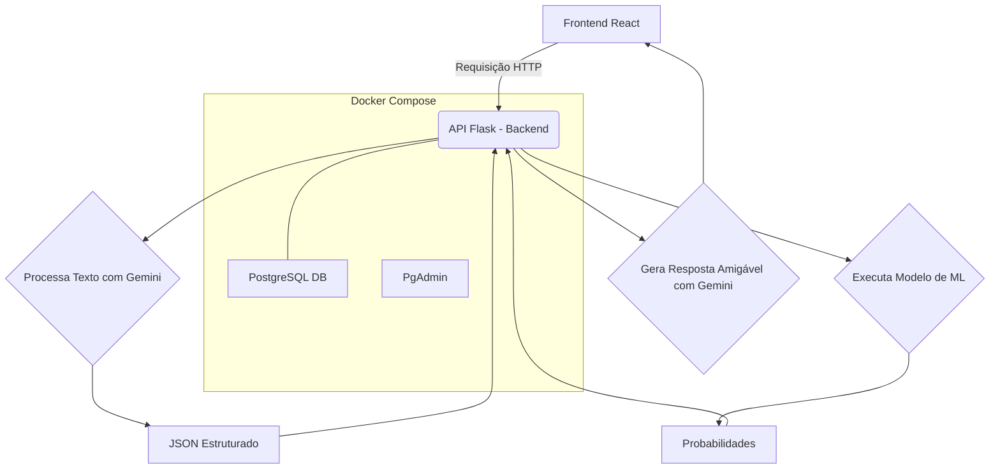
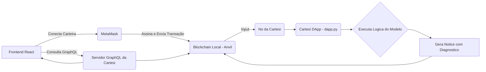

# 🧬 EpiScope - Analisador de Doenças com IA e Blockchain

O **EpiScope** é uma solução completa e inovadora que combina **Ciência de Dados**, **Inteligência Artificial** e **Blockchain** para criar um sistema de auxílio ao diagnóstico de arboviroses (**Dengue, Zika e Chikungunya**).  

A aplicação oferece duas modalidades de análise:  
- **API Web2 rápida e inteligente**, enriquecida com **IA Generativa (Google Gemini)**.  
- **DApp Web3**, que garante um diagnóstico verificável e descentralizado através da **Cartesi Machine**.  

---

## 📜 Índice
- ✨ [Funcionalidades Principais](#-funcionalidades-principais)
- 🏗️ [Arquitetura do Sistema](#-arquitetura-do-sistema)
- 🛠️ [Tecnologias Utilizadas](#-tecnologias-utilizadas)
- 🚀 [Começando](#-começando)
  - Pré-requisitos
  - Instalação e Configuração
  - Geração do Modelo de Machine Learning
- 🏃 [Como Executar a Aplicação Completa](#-como-executar-a-aplicação-completa)
- 📁 [Estrutura do Projeto](#-estrutura-do-projeto)
- 🔮 [Próximos Passos](#-próximos-passos)
- ⚖️ [Licença](#-licença)

---

## ✨ Funcionalidades Principais

- **Arquitetura Híbrida Web2 & Web3:** análise via API REST ou blockchain.  
- **Pipeline de Dados Completo:** ingestão, limpeza e armazenamento em PostgreSQL.  
- **Diagnóstico com IA:** modelo de **Árvore de Decisão** baseado em sintomas e dados clínicos.  
- **IA Generativa (Gemini):** interpreta linguagem natural e gera respostas humanizadas.  
- **Diagnóstico Verificável:** executado de forma descentralizada via **Cartesi Machine**.  
- **Interface Moderna:** **React + TypeScript + Vite**, integração com **MetaMask**.  
- **Ambiente 100% Dockerizado:** fácil execução com **Docker Compose**.  

---

## 🏗️ Arquitetura do Sistema

### Fluxo 1: Análise Rápida (Web2)



### Fluxo 2: Análise Verificável (Web3)



---

## 🛠️ Tecnologias Utilizadas

### **Backend (Web2)**
- Python (Flask)
- Google Gemini API  
- Scikit-learn  
- PostgreSQL  
- Docker Compose  

### **Blockchain (Web3)**
- Cartesi Machine  
- MetaMask  
- GraphQL (Cartesi Node)

### **Frontend**
- React + TypeScript + Vite  
- ethers.js  
- TailwindCSS  

### **DevOps**
- Docker & Docker Compose  

---

## 🚀 Começando

### Pré-requisitos
- Node.js e npm  
- Docker e Docker Compose  
- Cartesi CLI  
- Extensão MetaMask  

### Instalação e Configuração

```bash
# Clone o projeto principal (backend Web2 + frontend)
git clone https://github.com/bisnet0/EpiScope---Disease-Data-Analyzer.git

# Clone o projeto do DApp (backend Web3)
git clone https://github.com/bisnet0/EpiScope-dapp.git
```

Configure o `.env` e adicione sua `GEMINI_API_KEY`.

Instale as dependências do frontend:

```bash
cd EpiScope---Disease-Data-Analyzer/frontend
npm install
```

---

## 🧠 Geração do Modelo de Machine Learning

```bash
# Na raiz do EpiScope---Disease-Data-Analyzer
docker-compose up -d --build

# 1. Ingestão de dados
docker-compose exec backend python ingestion.py

# 2. Limpeza e preparação
docker-compose exec backend python clean_data.py

# 3. Treinamento do modelo
docker-compose exec backend python train_model.py

# 4. Exportar lógica para o DApp
docker-compose exec backend python export_model_logic.py
```

Cole o código gerado dentro da função `predict_diagnosis` do arquivo `dapp.py` no projeto **EpiScope-dapp**.

---

## 🏃 Como Executar a Aplicação Completa

Abra **três terminais**:

**Terminal 1 (Backend Web2):**
```bash
docker-compose up -d
```

**Terminal 2 (Backend Web3):**
```bash
cartesi run
```

**Terminal 3 (Frontend):**
```bash
npm run dev
```

Acesse: [http://localhost:5173](http://localhost:5173)  
Rede MetaMask: Localhost 8545 (Chain ID: 31337)

---

## 📁 Estrutura do Projeto

```
.
├── EpiScope---Disease-Data-Analyzer/
│   ├── backend/
│   │   ├── app.py
│   │   ├── clean_data.py
│   │   ├── train_model.py
│   │   └── ...
│   ├── frontend/
│   │   ├── src/
│   │   │   ├── App.tsx
│   │   │   └── components/
│   │   │       ├── DiagnosisForm.tsx
│   │   │       └── DiagnosisDAppForm.tsx
│   │   └── ...
│   └── docker-compose.yml
│
└── EpiScope-dapp/
    ├── dapp.py
    └── Dockerfile
```

---

## 🔮 Próximos Passos

- [ ] Melhorar acurácia para Chikungunya com mais dados.  
- [ ] Evitar polling infinito no GraphQL.  
- [ ] Adicionar CI/CD para builds e deploys.  
- [ ] Deploy do DApp em testnet Cartesi.

---

## ⚖️ Licença

Este projeto está sob a licença **MIT**.  
Criado com 🧠 por **Henrique Bisneto - 2025**  
