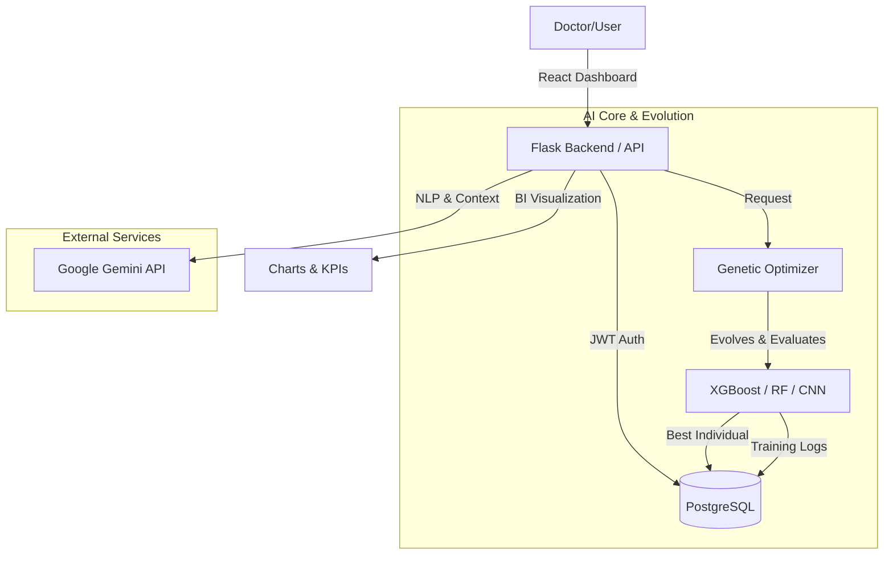
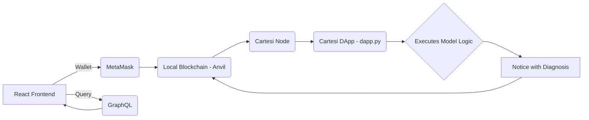
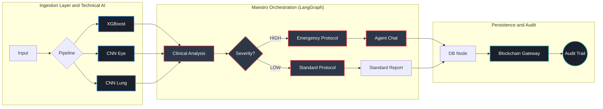

# 🧬 EpiScope - Disease Analyzer with AI and Blockchain

**EpiScope** is a complete solution that combines **Data Science**, **Artificial Intelligence**, and **Blockchain** to create a diagnostic support system for arboviruses (**Dengue, Zika, and Chikungunya**) and ocular diseases (**Glaucoma**).

The application offers two analysis modalities:

- **Fast and intelligent Web2 API**, with support for **Generative AI (Google Gemini)**.
- **Web3 DApp** with **verifiable and decentralized diagnosis via Cartesi Machine**.

---

## 📜 Table of Contents

- ✨ [Main Features](#-main-features)
- 🏗️ [System Architecture](#-system-architecture)
- 🛠️ [Technologies Used](#-technologies-used)
- 🚀 [Getting Started](#-getting-started)
  - Prerequisites
  - Installation and Configuration
- 🧠 [Model Generation and Training](#-model-generation-and-training)
- 🏃 [Full Application Execution](#-full-application-execution)
- 🌐 [Routes and Payloads](#-routes-and-payloads)
- 📁 [Project Structure](#-project-structure)
- 🔮 [Next Steps](#-next-steps)
- ⚖️ [License](#-license)

---

## ✨ Main Features

- **Web2 & Web3 Hybrid Architecture:** REST API + decentralized DApp.
- **Complete Data Pipeline:** ingestion, cleaning, training, and diagnosis.
- **Generative AI (Gemini):** interprets symptoms in natural language.
- **ML Diagnosis:** models for arboviruses and CNN for glaucoma.
- **Verifiable Diagnosis:** validation via **Cartesi Machine + MetaMask**.
- **Dockerized Environment:** fast and isolated execution with **Docker Compose**.
- **Robust Database:** **PostgreSQL + PgAdmin** with millions of records.

---

## 🏗️ System Architecture

### Flow 1: Fast Analysis (Web2)


```mermaid
graph TD
    User[Doctor/User] -->|React Dashboard| API[Flask Backend / API]
    API -->|JWT Auth| DB[(PostgreSQL)]

    subgraph "AI Core & Evolution"
        API -->|Request| GA[Genetic Optimizer]
        GA -->|Evolves & Evaluates| Models[XGBoost / RF / CNN]
        Models -->|Best Individual| DB
        Models -->|Training Logs| DB
    end

    subgraph "External Services"
        API -->|NLP & Context| Gemini[Google Gemini API]
    end

    API -->|BI Visualization| UI[Charts & KPIs]
```

### Flow 2: Verifiable Analysis (Web3)


```mermaid
graph LR
    A[React Frontend] -->|Wallet| B(MetaMask)
    B --> C(Local Blockchain - Anvil)
    C --> D(Cartesi Node)
    D --> E(Cartesi DApp - dapp.py)
    E --> F{Executes Model Logic}
    F --> G[Notice with Diagnosis]
    G --> C
    A -->|Query| H(GraphQL)
    H --> A
```

---

### Flow 3: Ingestion and Orchestration


```mermaid

graph LR
    %% Styling
    classDef tech fill:#1a202c,stroke:#3182ce,stroke-width:2px,color:#fff;
    classDef agent fill:#2d3748,stroke:#e53e3e,stroke-width:2px,color:#fff;
    classDef blockchain fill:#1a202c,stroke:#38b2ac,stroke-width:2px,color:#fff;

    subgraph "Ingestion Layer and Technical AI"
        A[Input] --> B{Pipeline}
        B --> B1[XGBoost]
        B --> B2[CNN Eye]
        B --> B3[CNN Lung]
    end

    subgraph "Maestro Orchestration (LangGraph)"
        B1 & B2 & B3 --> C[Clinical Analysis]
        C --> D{Severity?}
        D -- "HIGH" --> E[Emergency Protocol]
        D -- "LOW" --> F[Standard Protocol]
        E --> G[Agent Chat]
        F --> H[Standard Report]
    end

    subgraph "Persistence and Audit"
        G & H --> I[DB Node]
        I --> J[Blockchain Gateway]
        J --> K((Audit Trail))
    end

    %% Applying Classes
    class B1,B2,B3 tech;
    class C,D,E,F,G agent;
    class J,K blockchain;
```

---

## 🛠️ Technologies Used

## Backend (Web2)

- Python (Flask)
- Google Gemini API
- Scikit-learn
- TensorFlow / Keras (Glaucoma CNN)
- PostgreSQL + PgAdmin
- Docker & Docker Compose
- LangChain
- LangGraph
- Strava API
- Google Fit API

## Blockchain (Web3)

- Cartesi Machine or Nonodo
- MetaMask
- GraphQL (Cartesi Node)

## Frontend

- React + TypeScript + Vite
- ethers.js
- TailwindCSS

---

## 🚀 Getting Started

### Prerequisites

- Node.js and npm or yarn
- Docker and Docker Compose
- Cartesi CLI
- MetaMask Extension

### Installation and Configuration

```bash
# Clone the main project (Web2 + Frontend)
git clone https://github.com/bisnet0/EpiScope---Disease-Data-Analyzer.git

# Clone the DApp project (Web3)
git clone https://github.com/bisnet0/EpiScope-dapp.git
```

Create the `.env` file in the root with the following content:

```env
GEMINI_API_KEY=AIza....
POSTGRES_USER=bisnet0
POSTGRES_PASSWORD=RG4J8^%*TWjA*977Y40T81B2
POSTGRES_DB=episcope_db
JWT_SECRET_KEY=yoursecretheres
```

---

## 🧠 Model Generation and Training

Start the Docker environment:

```bash
docker-compose up -d --build
```

### 🔹 API Data Ingestion

```bash
docker-compose exec backend python backend/ml-workflow/arbovirus/ml_ingestion_data.py
```

### 🔹 External Data Ingestion (`new_data` Volume)

Create the `new_data/` directory (added to `.dockerignore` to avoid overhead)  
and add `.csv` or `.json` files from [OpenDataSUS](https://opendatasus.saude.gov.br/).

Rename files following the pattern:

```
chikungunya_2025.json
zika_2024.json
dengue_2023.json
```

Execute:

```bash
docker-compose exec backend python backend/ml-workflow/arbovirus/ml_ingest_new_data.py
```

### 🔹 Cleaning and Diagnosis

```bash
docker-compose exec backend python backend/ml-workflow/arbovirus/ml_clean_data.py
docker-compose exec backend python backend/ml-workflow/arbovirus/ml_diagnose_data.py
```

### 🔹 Training and Exporting

```bash
docker-compose exec backend python backend/ml-workflow/arbovirus/ml_train_model.py
docker-compose exec backend python backend/ml-workflow/arbovirus/ml_train_multimodels.py
```

The exported file will be used by the Cartesi Machine DApp.
Or if you just need to sign with Nonodo, simply run the DApp from Installation and Configuration.

### 🔹 Genetic Algorithm Optimization

```bash
docker-compose exec backend python backend/ml-workflow/arbovirus/ml_optimize_ga.py
```

### 🔹 Computer Vision: X-Ray (Pneumonia)

```bash

docker-compose exec backend python backend/ml-workflow/chest_xray/ml_train_xray.py
```

### 🔹 Computer Vision: Glaucoma

```bash

docker-compose exec backend python backend/ml-workflow/glaucoma/ml_train_glaucoma.py
```

### 🔹 LLM & Fine-Tuning (Medical Assistant)

```bash
docker-compose exec backend python backend/ml-workflow/llm/ml_generate_instruction_data.py
docker-compose exec backend python backend/ml-workflow/llm/ml_train_medical_assistant.py
docker-compose exec backend python backend/ml-workflow/llm/ml_validate_lora.py
```

---

## 🧩 CNN - Glaucoma Diagnosis

To activate the CNN, switch to the dedicated branch (`Optional, as all branches are merged into the Main branch`)

```bash
git checkout CNN-branch
```

Execute:

```bash
docker-compose exec backend python backend/ml-workflow/glaucoma/ml_train_cnn.py
```

The `drishti_gs/` volume contains training and test data.  
Inside it, there is a supervised Excel file for model training.

---

## 🏃 Full Application Execution

**Terminal 1 (Web2 Backend):**

```bash
docker-compose up -d
```

**Terminal 2 (Web3 Backend):**

```bash
# See DApp installation and configuration instructions
cartesi run
# Or
nonodo
# Or
npx ganache --wallet.seed "episcope_dapp" --chain.chainId 31337 --port 8545 --wallet.totalAccounts 1 --wallet.defaultBalance 10000
```

**Terminal 3 (Frontend):**

```bash
cd frontend/

# For NPM
npm install
npm run dev -- --host --port 3003

# OR

# For Yarn
yarn
yarn dev --host --port 3003

```

Access: [http://localhost:3003](http://localhost:3003)  
PgAdmin: [http://localhost:5050](http://localhost:5050)  
Login: `admin@admin.com` / Password: `admin`

---

## 🌐 Routes and Payloads

## 🔐 Authentication (JWT via Cookies)

**Note:** All protected endpoints require the `access_token_cookie` cookie, automatically set after **Login/Register**.

---

### 🔹 `POST /auth/register` -- User Registration

**Payload**

```json
{
  "username": "doctor_01",
  "email": "doctor@hospital.com",
  "password": "strong_password"
}
```

**Response (201)**

```json
{
  "message": "User created successfully",
  "user": {
    "id": "uuid...",
    "username": "doctor_01",
    "email": "doctor@hospital.com"
  }
}
```

---

### 🔹 `POST /auth/login` -- Login

**Payload**

```json
{
  "email": "doctor@hospital.com",
  "password": "strong_password"
}
```

**Response (200)**

```json
{
  "message": "Login successful",
  "user": {
    "id": "uuid...",
    "username": "doctor_01"
  }
}
```

---

### 🔹 `POST /auth/logout` -- Logout

**Response (200)**

```json
{
  "message": "Logout successful"
}
```

---

### 🔹 `GET /auth/me` -- Authenticated User

**Response (200)**

```json
{
  "id": "uuid...",
  "username": "doctor_01",
  "email": "doctor@hospital.com"
}
```

---

## 🏥 Clinical Diagnosis (Arboviruses & Glaucoma)

---

### 🔹 `POST /diagnose` -- Textual Diagnosis

Processes symptoms described in natural language.

**Payload**

```json
{
  "text_description": "Patient reports retro-orbital pain and rash.",
  "age": 26,
  "sex": "M"
}
```

**Response**

```json
{
  "analysis_details": {
    "probabilities": {
      "chikungunya": 0.15,
      "dengue": 0.84,
      "zika": 0.01
    },
    "structured_symptoms": {
      "dor_retro": true,
      "exantema": true
    }
  },
  "friendly_response": "The analysis indicates a high probability of Dengue..."
}
```

---

### 🔹 `POST /diagnose-glaucoma` -- Image Diagnosis

Processes fundus image (Computer Vision).

**Payload:** `multipart/form-data` with key `image`

**Response**

```json
{
  "analysis_details": {
    "predicted_class": "Glaucomatous",
    "confidence": 0.9146,
    "probabilities": {
      "Normal": 0.08,
      "Glaucomatous": 0.91
    }
  }
}
```

---

### 🔹 `GET /diagnose/history` -- Diagnosis History

Returns the diagnosis history of the logged-in user.

**Response**

```json
[
  {
    "id": 1,
    "type": "Arbovirus",
    "date": "2026-01-20T10:00:00Z",
    "details": "Symptoms: High fever...",
    "result": "Dengue",
    "signature": "0x123abc... (Cartesi Hash)"
  }
]
```

---

## 🧬 Genetic Laboratory (Evolutionary AI)

---

### 🔹 `POST /diagnose/optimize-ga` -- Genetic Algorithm Optimization

Starts a genetic evolution to optimize hyperparameters.

**Payload**

```json
{
  "model_type": "xgboost",
  "generations": 5,
  "population_size": 20,
  "mutation_rate": 0.1,
  "crossover_rate": 0.7
}
```

**Response**

```json
{
  "success": true,
  "best_individual": {
    "accuracy": 0.85,
    "params": {
      "max_depth": 7,
      "learning_rate": 0.05,
      "n_estimators": 150
    }
  },
  "history": [
    {
      "generation": 1,
      "avg_accuracy": 0.7,
      "best_accuracy": 0.75
    },
    {
      "generation": 5,
      "avg_accuracy": 0.82,
      "best_accuracy": 0.85
    }
  ]
}
```

---

### 🔹 `POST /diagnose/experiment` -- Manual Experiment

Executes a single experiment with defined parameters.

**Payload**

```json
{
  "model_type": "random_forest",
  "params": {
    "n_estimators": 100,
    "max_depth": 10
  }
}
```

---

## 📊 Dashboard & Analytics

---

### 🔹 `GET /dashboard/stats` -- KPIs and Analytics

Returns data for Business Intelligence charts.

**Query Params (optional):** - `period=7d` - `model=xgboost`

**Response**

```json
{
  "kpis": {
    "total_diagnoses": 150,
    "best_ai_accuracy": 89.5,
    "arbovirus_count": 120,
    "glaucoma_count": 30
  },
  "charts": {
    "model_performance": [{ "name": "XGBoost", "accuracy": 88.2 }],
    "learning_curve": [{ "date": "20/01 10:00", "accuracy": 85.0 }],
    "ga_analysis": {
      "mutation": [
        { "x": 0.1, "y": 85.0 },
        { "x": 0.5, "y": 70.0 }
      ],
      "population": []
    }
  }
}
```

---

## 📁 Project Structure

```
episcope/
├── backend/
│   ├── controllers/
│   │   ├── auth_controller.py       # Login/Register and JWT logic
│   │   ├── dashboard_controller.py  # Data mining for BI and Charts
│   │   └── diagnose_controller.py   # AI Endpoints (Arbovirus, Glaucoma, GA)
│   ├── models/
│   │   ├── user_model.py            # Users Table
│   │   ├── diagnosis_model.py       # Clinical Diagnoses Tables
│   │   └── ml_log_model.py          # Training Logs and Genetic Experiments
│   ├── services/
│   │   ├── ai_service.py            # AI Engine (XGBoost, Random Forest, CNN)
│   │   ├── auth_service.py          # Security logic
│   │   └── genetic_optimizer.py     # Genetic Algorithm (Crossover/Mutation)
│   ├── tests/
│   │   ├── conftest.py              # Pytest Configuration (In-Memory Database)
│   │   └── test_routes.py           # Integration Tests (Auth, Dash, AI)
│   ├── app.py                       # Entry point (Flask App & Blueprints)
│   ├── routes.py                    # API URL definitions
│   ├── Dockerfile                   # Backend Containerization
│   └── requirements.txt             # Python Dependencies
│
├── frontend/
│   ├── src/
│   │   ├── components/
│   │   │   ├── Dashboard.tsx        # BI Panel with Recharts
│   │   │   ├── ExperimentsPanel.tsx # Genetic Laboratory
│   │   │   ├── LoginForm.tsx        # Authentication Form
│   │   │   └── DiagnosisForm.tsx    # Clinical Form
│   │   ├── context/
│   │   │   └── AuthContext.tsx      # Session and Wallet Management
│   │   ├── services/
│   │   │   └── api.ts               # Configured Axios client
│   │   └── App.tsx                  # Main Routing and Layout
│   └── package.json                 # React/Vite Dependencies
│
├── episcope-dapp/                   # Web3 Module (Cartesi)
│   ├── dapp.py                      # Python DApp Logic (Blockchain Backend)
│   └── docker-compose.yml           # Cartesi node orchestration
│
└── docker-compose.yml               # General Orchestration (Web2 + DB + PgAdmin)
```

---

## 🔮 Next Steps

- [x] Increase Zika Virus database.
- [x] Improve CNN inference for glaucoma.
- [ ] Add automated CI/CD.
- [ ] Deploy DApp on Cartesi testnet.

---

## ⚖️ License

This project is under the **MIT** license.  
Created with 🧠 by **Henrique Bisneto - 2026**
