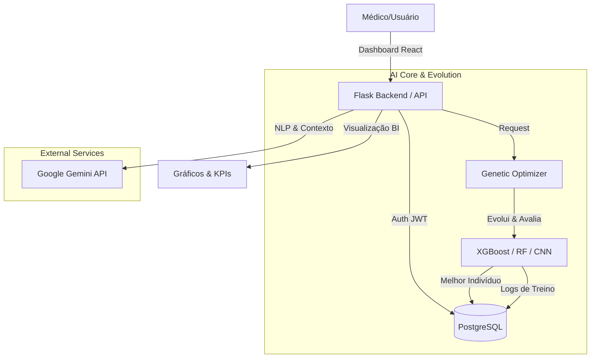
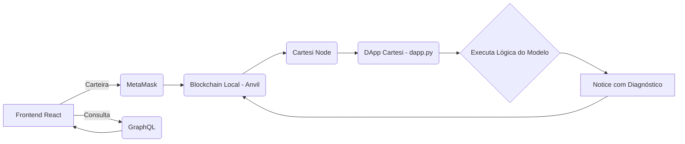
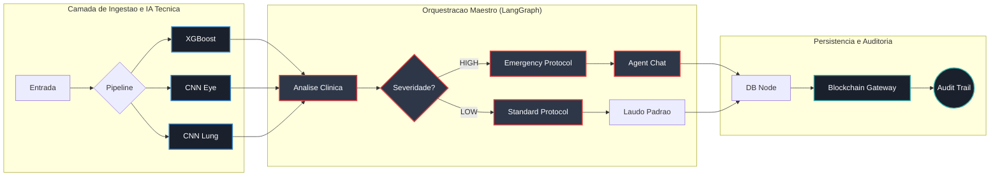

# 🧬 EpiScope - Analisador de Doenças com IA e Blockchain

O **EpiScope** é uma solução completa que une **Ciência de Dados**, **Inteligência Artificial** e **Blockchain** para criar um sistema de apoio ao diagnóstico de arboviroses (**Dengue, Zika e Chikungunya**) e doenças oculares (**Glaucoma**).

A aplicação oferece duas modalidades de análise:

- **API Web2 rápida e inteligente**, com suporte à **IA Generativa (Google Gemini)**.
- **DApp Web3** com diagnóstico **verificável e descentralizado via Cartesi Machine**.

---

## 📜 Índice

- ✨ [Funcionalidades Principais](#-funcionalidades-principais)
- 🏗️ [Arquitetura do Sistema](#-arquitetura-do-sistema)
- 🛠️ [Tecnologias Utilizadas](#-tecnologias-utilizadas)
- 🚀 [Começando](#-começando)
  - Pré-requisitos
  - Instalação e Configuração
- 🧠 [Geração e Aprendizado de Modelos](#-geração-e-aprendizado-de-modelos)
- 🏃 [Execução da Aplicação Completa](#-execução-da-aplicação-completa)
- 🌐 [Rotas e Payloads](#-rotas-e-payloads)
- 📁 [Estrutura do Projeto](#-estrutura-do-projeto)
- 🔮 [Próximos Passos](#-próximos-passos)
- ⚖️ [Licença](#-licença)

---

## ✨ Funcionalidades Principais

- **Arquitetura Híbrida Web2 & Web3:** API REST + DApp descentralizado.
- **Pipeline de Dados Completo:** ingestão, limpeza, treinamento e diagnóstico.
- **IA Generativa (Gemini):** interpreta sintomas em linguagem natural.
- **Diagnóstico com ML:** modelos para arboviroses e CNN para glaucoma.
- **Diagnóstico Verificável:** validação via **Cartesi Machine + MetaMask**.
- **Ambiente Dockerizado:** execução rápida e isolada com **Docker Compose**.
- **Banco de Dados Robusto:** **PostgreSQL + PgAdmin** com milhões de registros.

---

## 🏗️ Arquitetura do Sistema

### Fluxo 1: Análise Rápida (Web2)


```mermaid
graph TD
    User[Médico/Usuário] -->|Dashboard React| API[Flask Backend / API]
    API -->|Auth JWT| DB[(PostgreSQL)]

    subgraph "AI Core & Evolution"
        API -->|Request| GA[Genetic Optimizer]
        GA -->|Evolui & Avalia| Models[XGBoost / RF / CNN]
        Models -->|Melhor Indivíduo| DB
        Models -->|Logs de Treino| DB
    end

    subgraph "External Services"
        API -->|NLP & Contexto| Gemini[Google Gemini API]
    end

    API -->|Visualização BI| UI[Gráficos & KPIs]
```

### Fluxo 2: Análise Verificável (Web3)


```mermaid
graph LR
    A[Frontend React] -->|Carteira| B(MetaMask)
    B --> C(Blockchain Local - Anvil)
    C --> D(Cartesi Node)
    D --> E(DApp Cartesi - dapp.py)
    E --> F{Executa Lógica do Modelo}
    F --> G[Notice com Diagnóstico]
    G --> C
    A -->|Consulta| H(GraphQL)
    H --> A
```

---

### Fluxo 3: Ingestão e Orquestração


```mermaid

graph LR
    %% Estilização
    classDef tech fill:#1a202c,stroke:#3182ce,stroke-width:2px,color:#fff;
    classDef agent fill:#2d3748,stroke:#e53e3e,stroke-width:2px,color:#fff;
    classDef blockchain fill:#1a202c,stroke:#38b2ac,stroke-width:2px,color:#fff;

    subgraph "Camada de Ingestao e IA Tecnica"
        A[Entrada] --> B{Pipeline}
        B --> B1[XGBoost]
        B --> B2[CNN Eye]
        B --> B3[CNN Lung]
    end

    subgraph "Orquestracao Maestro (LangGraph)"
        B1 & B2 & B3 --> C[Analise Clinica]
        C --> D{Severidade?}
        D -- "HIGH" --> E[Emergency Protocol]
        D -- "LOW" --> F[Standard Protocol]
        E --> G[Agent Chat]
        F --> H[Laudo Padrao]
    end

    subgraph "Persistencia e Auditoria"
        G & H --> I[DB Node]
        I --> J[Blockchain Gateway]
        J --> K((Audit Trail))
    end

    %% Aplicando Classes
    class B1,B2,B3 tech;
    class C,D,E,F,G agent;
    class J,K blockchain;
```
---

## 🛠️ Tecnologias Utilizadas

## Backend (Web2)

- Python (Flask)
- Google Gemini API
- Scikit-learn
- TensorFlow / Keras (CNN Glaucoma)
- PostgreSQL + PgAdmin
- Docker & Docker Compose

## Blockchain (Web3)

- Cartesi Machine ou Nonodo
- MetaMask
- GraphQL (Cartesi Node)

## Frontend

- React + TypeScript + Vite
- ethers.js
- TailwindCSS

---

## 🚀 Começando

### Pré-requisitos

- Node.js e npm ou yarn
- Docker e Docker Compose
- Cartesi CLI
- Extensão MetaMask

### Instalação e Configuração

```bash
# Clone o projeto principal (Web2 + Frontend)
git clone https://github.com/bisnet0/EpiScope---Disease-Data-Analyzer.git

# Clone o projeto do DApp (Web3)
git clone https://github.com/bisnet0/EpiScope-dapp.git
````

Crie o arquivo `.env` na raiz com o seguinte conteúdo:

```env
GEMINI_API_KEY=AIza....
POSTGRES_USER=bisnet0
POSTGRES_PASSWORD=RG4J8^%*TWjA*977Y40T81B2
POSTGRES_DB=episcope_db
JWT_SECRET_KEY=suasecretaqui
```

---

## 🧠 Geração e Aprendizado de Modelos

Suba o ambiente Docker:

```bash
docker-compose up -d --build
```

### 🔹 Ingestão de Dados da API

```bash
docker-compose exec backend python backend/ml-workflow/arbovirus/ml_ingestion_data.py
```

### 🔹 Ingestão de Dados Externos (Volume `new_data`)

Crie o diretório `new_data/` (adicionado ao `.dockerignore` para evitar sobrecarga)  
e adicione arquivos `.csv` ou `.json` do [OpenDataSUS](https://opendatasus.saude.gov.br/).

Renomeie os arquivos seguindo o padrão:

```
chikungunya_2025.json
zika_2024.json
dengue_2023.json
```

Execute:

```bash
docker-compose exec backend python backend/ml-workflow/arbovirus/ml_ingest_new_data.py
```

### 🔹 Limpeza e Diagnóstico

```bash
docker-compose exec backend python backend/ml-workflow/arbovirus/ml_clean_data.py
docker-compose exec backend python backend/ml-workflow/arbovirus/ml_diagnose_data.py
```

### 🔹 Treinamento e Exportação

```bash
docker-compose exec backend python backend/ml-workflow/arbovirus/ml_train_model.py
docker-compose exec backend python backend/ml-workflow/arbovirus/ml_train_multimodels.py
```

O arquivo exportado será usado pelo DApp da Cartesi Machine.
Ou se for o caso de apenas assinar com o Nonodo basta rodar o DApp da Instalação e Configuração.

### 🔹 Otimização do Algoritmo Genético

```bash
docker-compose exec backend python backend/ml-workflow/arbovirus/ml_optimize_ga.py
```

---

## 🧩 CNN - Diagnóstico de Glaucoma

Para ativar a CNN, mude para a branch dedicada (`Opcional, pois todas as branchs estão mergeadas na branch Main`)

```bash
git checkout CNN-branch
```

Execute:

```bash
docker-compose exec backend python backend/ml-workflow/glaucoma/ml_train_cnn.py
```

O volume `drishti_gs/` contém os dados de treinamento e teste.  
Dentro dele há um arquivo Excel supervisionado para aprendizado do modelo.

---

## 🏃 Execução da Aplicação Completa

**Terminal 1 (Backend Web2):**

```bash
docker-compose up -d
```

**Terminal 2 (Backend Web3):**

```bash
# Vide instruções de instalação e configuração do DApp
cartesi run
# Ou
nonodo
```

**Terminal 3 (Frontend):**

```bash
cd frontend/

# Para NPM
npm install
npm run dev -- --host --port 3003

# OU

# Para Yarn
yarn
yarn dev --host --port 3003

```

Acesse: [http://localhost:3003](http://localhost:3003)  
PgAdmin: [http://localhost:5050](http://localhost:5050)  
Login: `admin@admin.com` / Senha: `admin`

---

## 🌐 Rotas e Payloads

## 🔐 Autenticação (JWT via Cookies)

**Nota:** Todos os endpoints protegidos exigem o cookie
`access_token_cookie`, setado automaticamente após **Login/Register**.

---

### 🔹 `POST /auth/register` -- Registro de usuário

**Payload**

```json
{
  "username": "medico_01",
  "email": "medico@hospital.com",
  "password": "senha_forte"
}
```

**Response (201)**

```json
{
  "message": "Usuário criado com sucesso",
  "user": {
    "id": "uuid...",
    "username": "medico_01",
    "email": "medico@hospital.com"
  }
}
```

---

### 🔹 `POST /auth/login` -- Login

**Payload**

```json
{
  "email": "medico@hospital.com",
  "password": "senha_forte"
}
```

**Response (200)**

```json
{
  "message": "Login realizado com sucesso",
  "user": {
    "id": "uuid...",
    "username": "medico_01"
  }
}
```

---

### 🔹 `POST /auth/logout` -- Logout

**Response (200)**

```json
{
  "message": "Logout realizado com sucesso"
}
```

---

### 🔹 `GET /auth/me` -- Usuário autenticado

**Response (200)**

```json
{
  "id": "uuid...",
  "username": "medico_01",
  "email": "medico@hospital.com"
}
```

---

## 🏥 Diagnóstico Clínico (Arboviroses & Glaucoma)

---

### 🔹 `POST /diagnose` -- Diagnóstico textual

Processa sintomas descritos em linguagem natural.

**Payload**

```json
{
  "text_description": "Paciente relata dor retro-orbital e exantema.",
  "age": 26,
  "sex": "M"
}
```

**Response**

```json
{
  "analysis_details": {
    "probabilities": {
      "chikungunya": 0.15,
      "dengue": 0.84,
      "zika": 0.01
    },
    "structured_symptoms": {
      "dor_retro": true,
      "exantema": true
    }
  },
  "friendly_response": "A análise indica alta probabilidade de Dengue..."
}
```

---

### 🔹 `POST /diagnose-glaucoma` -- Diagnóstico por imagem

Processa imagem de fundo de olho (Visão Computacional).

**Payload:** `multipart/form-data` com key `image`

**Response**

```json
{
  "analysis_details": {
    "predicted_class": "Glaucomatous",
    "confidence": 0.9146,
    "probabilities": {
      "Normal": 0.08,
      "Glaucomatous": 0.91
    }
  }
}
```

---

### 🔹 `GET /diagnose/history` -- Histórico de diagnósticos

Retorna o histórico de diagnósticos do usuário logado.

**Response**

```json
[
  {
    "id": 1,
    "type": "Arbovirose",
    "date": "2026-01-20T10:00:00Z",
    "details": "Sintomas: Febre alta...",
    "result": "Dengue",
    "signature": "0x123abc... (Hash Cartesi)"
  }
]
```

---

## 🧬 Laboratório Genético (IA Evolutiva)

---

### 🔹 `POST /diagnose/optimize-ga` -- Otimização com Algoritmo Genético

Inicia uma evolução genética para otimizar hiperparâmetros.

**Payload**

```json
{
  "model_type": "xgboost",
  "generations": 5,
  "population_size": 20,
  "mutation_rate": 0.1,
  "crossover_rate": 0.7
}
```

**Response**

```json
{
  "success": true,
  "best_individual": {
    "accuracy": 0.85,
    "params": {
      "max_depth": 7,
      "learning_rate": 0.05,
      "n_estimators": 150
    }
  },
  "history": [
    {
      "generation": 1,
      "avg_accuracy": 0.7,
      "best_accuracy": 0.75
    },
    {
      "generation": 5,
      "avg_accuracy": 0.82,
      "best_accuracy": 0.85
    }
  ]
}
```

---

### 🔹 `POST /diagnose/experiment` -- Experimento manual

Executa um experimento único com parâmetros definidos.

**Payload**

```json
{
  "model_type": "random_forest",
  "params": {
    "n_estimators": 100,
    "max_depth": 10
  }
}
```

---

## 📊 Dashboard & Analytics

---

### 🔹 `GET /dashboard/stats` -- KPIs e Analytics

Retorna dados para gráficos de Business Intelligence.

**Query Params (opcionais):** - `period=7d` - `model=xgboost`

**Response**

```json
{
  "kpis": {
    "total_diagnoses": 150,
    "best_ai_accuracy": 89.5,
    "arbovirus_count": 120,
    "glaucoma_count": 30
  },
  "charts": {
    "model_performance": [{ "name": "XGBoost", "accuracy": 88.2 }],
    "learning_curve": [{ "date": "20/01 10:00", "accuracy": 85.0 }],
    "ga_analysis": {
      "mutation": [
        { "x": 0.1, "y": 85.0 },
        { "x": 0.5, "y": 70.0 }
      ],
      "population": []
    }
  }
}
```

---

## 📁 Estrutura do Projeto

```
episcope/
├── backend/
│   ├── controllers/
│   │   ├── auth_controller.py       # Lógica de Login/Registro e JWT
│   │   ├── dashboard_controller.py  # Mineração de dados para BI e Gráficos
│   │   └── diagnose_controller.py   # Endpoints de IA (Arbovirose, Glaucoma, GA)
│   ├── models/
│   │   ├── user_model.py            # Tabela de Usuários
│   │   ├── diagnosis_model.py       # Tabelas de Diagnósticos Clínicos
│   │   └── ml_log_model.py          # Logs de Treinamento e Experimentos Genéticos
│   ├── services/
│   │   ├── ai_service.py            # Motor de IA (XGBoost, Random Forest, CNN)
│   │   ├── auth_service.py          # Lógica de segurança
│   │   └── genetic_optimizer.py     # Algoritmo Genético (Crossover/Mutação)
│   ├── tests/
│   │   ├── conftest.py              # Configuração do Pytest (Banco em Memória)
│   │   └── test_routes.py           # Testes de Integração (Auth, Dash, AI)
│   ├── app.py                       # Ponto de entrada (Flask App & Blueprints)
│   ├── routes.py                    # Definição das URLs da API
│   ├── Dockerfile                   # Containerização do Backend
│   └── requirements.txt             # Dependências Python
│
├── frontend/
│   ├── src/
│   │   ├── components/
│   │   │   ├── Dashboard.tsx        # Painel de BI com Recharts
│   │   │   ├── ExperimentsPanel.tsx # Laboratório Genético
│   │   │   ├── LoginForm.tsx        # Formulário de Autenticação
│   │   │   └── DiagnosisForm.tsx    # Formulário Clínico
│   │   ├── context/
│   │   │   └── AuthContext.tsx      # Gerenciamento de Sessão e Wallet
│   │   ├── services/
│   │   │   └── api.ts               # Cliente Axios configurado
│   │   └── App.tsx                  # Roteamento e Layout Principal
│   └── package.json                 # Dependências React/Vite
│
├── episcope-dapp/                   # Módulo Web3 (Cartesi)
│   ├── dapp.py                      # Lógica do DApp Python (Back-end Blockchain)
│   └── docker-compose.yml           # Orquestração do nó Cartesi
│
└── docker-compose.yml               # Orquestração Geral (Web2 + DB + PgAdmin)
```

---

## 🔮 Próximos Passos

- [x] Aumentar base de dados Zika Vírus.
- [x] Melhorar inferência CNN para glaucoma.
- [ ] Adicionar CI/CD automatizado.
- [ ] Deploy do DApp em testnet Cartesi.

---

## ⚖️ Licença

Este projeto está sob a licença **MIT**.  
Criado com 🧠 por **Henrique Bisneto - 2026**
